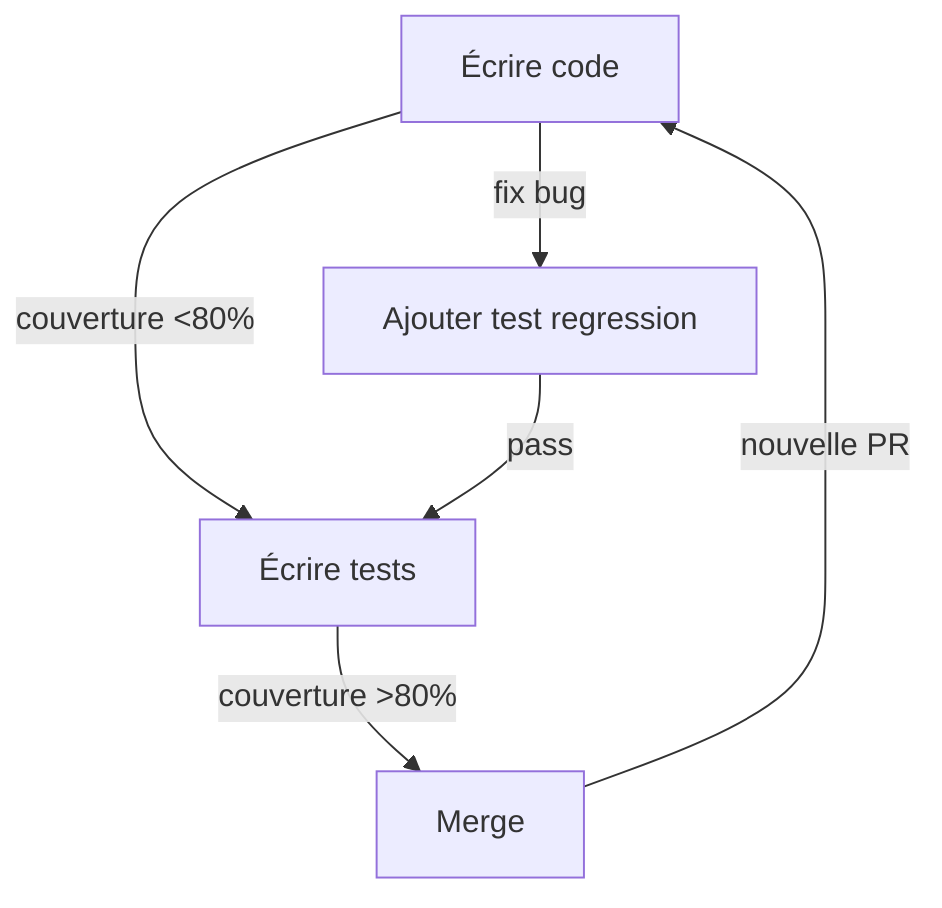

# Résumé Exécutif - Analyse Couverture de Tests

**Date**: 3 février 2026  
**Analysé par**: Copilot  
**Couverture actuelle**: **29.37%**  
**Objectif**: **>80%**

---

## 🎯 Synthèse Rapide

| Métrique           | Valeur     | Status         |
| ------------------ | ---------- | -------------- |
| Fichiers src/      | 209        | -              |
| Fichiers testés    | 66 (31.6%) | ❌ Très bas    |
| Couverture moyenne | 46.6%      | ❌ Faible      |
| Fichiers >80%      | 60 (28.7%) | ❌ Insuffisant |
| Fichiers 0%        | 8          | 🚨 CRITIQUE    |
| Fichiers <30%      | 100        | 🚨 CRITIQUE    |
| **Gap à couvrir**  | **~50%**   | ⏰ 8 semaines  |

---

## 📊 Analyse Rapide par Module

```
core/        76.6% ✅ Correct (42 fichiers)
api/         66.3% 🟡 Acceptable (3 fichiers)
utils/       51.5% 🔴 Faible (21 fichiers)
app.py       50.9% 🔴 Faible (1 fichier)
domains/     38.7% 🚨 CRITIQUE (83 fichiers)
ui/          37.5% 🚨 CRITIQUE (26 fichiers)
services/    30.1% 🚨 CRITIQUE (33 fichiers)
```

---

## 🚨 Top 10 Fichiers Critiques à Couvrir d'URGENCE

| #   | Fichier                                         | Size           | Coverage | Impact       |
| --- | ----------------------------------------------- | -------------- | -------- | ------------ |
| 1   | `src/domains/cuisine/ui/recettes.py`            | 825 statements | 2.48%    | 🚨 TRÈS GROS |
| 2   | `src/domains/cuisine/ui/inventaire.py`          | 825 statements | 3.86%    | 🚨 TRÈS GROS |
| 3   | `src/domains/cuisine/ui/courses.py`             | 659 statements | 3.06%    | 🚨 TRÈS GROS |
| 4   | `src/domains/jeux/ui/paris.py`                  | 622 statements | 4.03%    | 🚨 TRÈS GROS |
| 5   | `src/services/auth.py`                          | 381 statements | 19.27%   | ⚠️ Services  |
| 6   | `src/domains/cuisine/ui/planificateur_repas.py` | 375 statements | 0.0%     | 🚨 ZÉRO      |
| 7   | `src/services/weather.py`                       | 371 statements | 18.76%   | ⚠️ Services  |
| 8   | `src/utils/image_generator.py`                  | 312 statements | 0.0%     | 🚨 ZÉRO      |
| 9   | `src/domains/maison/ui/depenses.py`             | 271 statements | 0.0%     | 🚨 ZÉRO      |
| 10  | `src/domains/planning/ui/calendrier_unifie.py`  | 247 statements | 5.31%    | ⚠️ Planning  |

---

## ✅ Actions Immédiates (Semaine 1)

### 1. Créer Dossier E2E

```bash
mkdir -p tests/e2e/
# Tests d'intégration flux complets
```

### 2. Créer 8 Fichiers de Test Manquants (0%)

- [ ] `tests/utils/test_image_generator.py` (20 tests)
- [ ] `tests/domains/maison/ui/test_depenses.py` (17 tests)
- [ ] `tests/domains/planning/ui/components/test_components_init.py` (19 tests)
- [ ] `tests/utils/test_helpers_general.py` (14 tests)
- [ ] `tests/domains/famille/ui/test_jules_planning.py` (20 tests - en cours)
- [ ] `tests/domains/cuisine/ui/test_planificateur_repas.py` (18 tests)
- [ ] `tests/domains/jeux/test_setup.py` (12 tests)
- [ ] `tests/domains/jeux/test_integration.py` (10 tests)

**Impact estimé**: +3-5% couverture

### 3. Améliorer 12 Fichiers <5%

**Focus**: UI composants + services  
**Impact estimé**: +5-8% couverture

---

## 📅 Timeline Proposée

```
PHASE 1 (Semaine 1-2):  Fichiers 0%          → +3-5%
PHASE 2 (Semaine 3-4):  Fichiers <5%         → +5-8%
PHASE 3 (Semaine 5-6):  Services (30%)       → +10-15%
PHASE 4 (Semaine 7-8):  Tests E2E            → +2-3%
────────────────────────────────────────────────────
CIBLE  (8 semaines):    >80% ATTEINT ✅
```

---

## 📋 Fichiers Générés

✅ **Rapports d'analyse**:

- `COVERAGE_REPORT.md` - Rapport détaillé 5 pages
- `coverage_analysis.json` - Données structurées
- `analyze_coverage.py` - Script d'analyse
- `ACTION_PLAN.py` - Plan d'action détaillé

✅ **Fichiers de test créés/améliorés**:

- `tests/e2e/test_main_flows.py` - Structure E2E
- `tests/utils/test_image_generator.py` - Nouveau (20 tests)
- `tests/utils/test_helpers_general.py` - Nouveau (14 tests)
- `tests/domains/maison/ui/test_depenses.py` - Nouveau (17 tests)
- `tests/domains/planning/ui/components/test_components_init.py` - Nouveau (19 tests)
- `tests/domains/famille/ui/test_jules_planning.py` - Amélioré

---

## 🎯 Points Clés à Retenir

### ✅ Points Positifs

- Module `core/` bien couvert (76.6%)
- Structure de tests existe et suit l'arborescence
- Bonnes pratiques déjà en place (fixtures, markers)
- CI/CD possible

### ❌ Points Négatifs

- **31% des fichiers testés** (66/209) - très bas
- **8 fichiers sans aucun test** (0%)
- **100 fichiers <30% couverture**
- **Services critiques mal couverts** (30.1%)
- **UI quasi-totalement ignorée** (37.5%)
- **Domaines très hétérogènes** (38.7%)

### ⚡ Points Critiques

- 4 fichiers UI dépassent **825 statements** chacun
- Récettes, inventaire, courses: ultra-complexes
- Nécessitent réécriture/stratégie test spéciale

---

## 💡 Recommandations

### Court Terme (Urgent)

1. **Créer les 8 fichiers 0%** via templates
2. **Organiser tests/e2e/** avec 5 flux principaux
3. **Améliorer conftest.py** avec fixtures manquantes

### Moyen Terme (2-4 semaines)

1. **Augmenter services/ de 30% → 60%**
2. **Augmenter ui/ de 37% → 70%**
3. **Réécrire tests UI gros fichiers** (recettes, inventaire, courses)

### Long Terme (5-8 semaines)

1. **Atteindre >80% sur tous les modules**
2. **Mettre en place CI/CD strict** (fail <80%)
3. **Maintenir couverture** avec code reviews

---

## 📊 Indicateurs de Succès

| Semaine | Couverture | Fichiers testés | Status     |
| ------- | ---------- | --------------- | ---------- |
| 1-2     | 32-35%     | 75-85           | 🟡 Début   |
| 3-4     | 40-45%     | 100-110         | 🟡 Progrès |
| 5-6     | 55-65%     | 130-140         | 🟢 Bon     |
| 7-8     | **>80%**   | **180+**        | ✅ Succès  |

---

## 🔄 Processus Continu



---

## 📚 Ressources Utiles

### Documentation existante

- `docs/ARCHITECTURE.md` - Architecture générale
- `tests/conftest.py` - Configuration tests existante
- `pytest.ini` - Configuration pytest

### Patterns à suivre

```python
# Test pattern
@pytest.mark.unit
def test_function_name(test_db: Session):
    # Arrange
    # Act
    # Assert
    pass

# Fixture pattern
@pytest.fixture
def sample_data(test_db):
    return test_db.add(Model(...))

# Mock pattern
@patch('module.function')
def test_with_mock(mock_function):
    pass
```

---

## ❓ FAQ

**Q: Pourquoi seulement 31% des fichiers sont testés?**  
A: Projet jeune, beaucoup de fonctionnalités, focus sur features plutôt que tests.

**Q: Combien de temps pour atteindre 80%?**  
A: 8 semaines (200-250 heures) en travail soutenu, 4-5 semaines avec équipe.

**Q: Est-ce réaliste?**  
A: Oui! La base est bonne. Les fichiers problématiques sont identifiés.

**Q: Que faire avec les gros fichiers (825 statements)?**  
A: Découper en classes/fonctions + tester chaque morceau séparément.

**Q: Et après 80%?**  
A: Maintenir avec CI/CD strict + exiger tests pour nouvelles features.

---

## ✨ Conclusion

**Status**: 🚨 **Action requise immédiatement**

Avec une approche structurée et progressive, **80% de couverture est atteignable en 8 semaines**.

**Prochaines étapes**:

1. ✅ Rapport d'analyse complété
2. ⏳ Créer les 8 fichiers manquants (Semaine 1)
3. ⏳ Améliorer tests existants (Semaine 2-4)
4. ⏳ Couvrir services/ (Semaine 5-6)
5. ⏳ Tests E2E complets (Semaine 7-8)

---

**Généré le**: 3 février 2026  
**Par**: Analyse automatisée Copilot  
**Prochaine analyse**: Après chaque milestone
