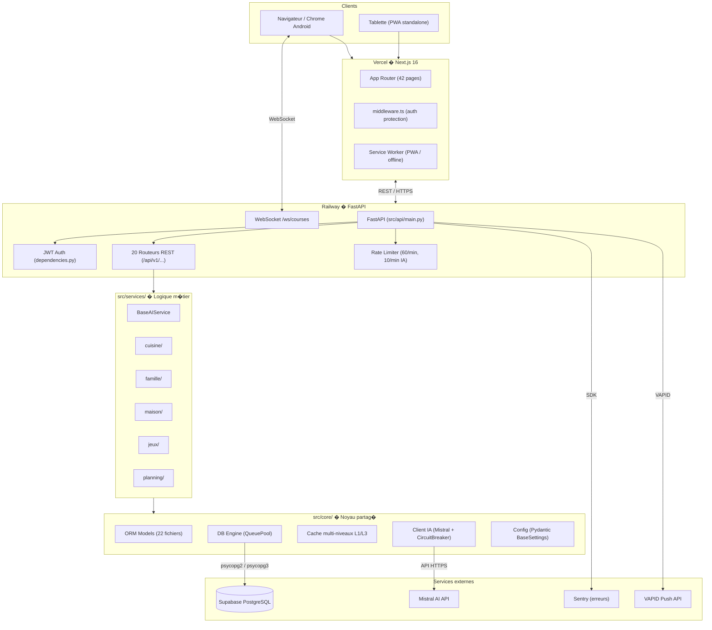
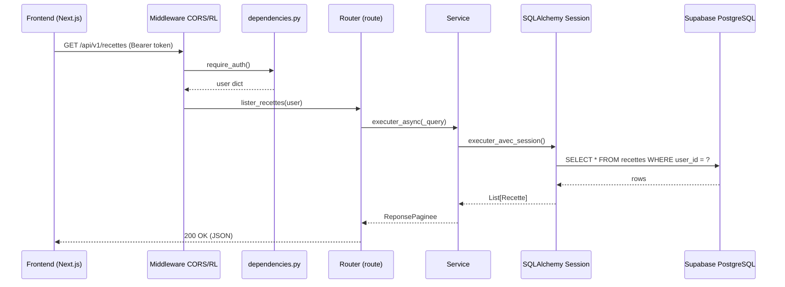

# ??? Architecture Technique - Assistant Matanne

> **Derni�re mise � jour**: 1 mars 2026

## Vue d'ensemble

```
+-----------------------------------------------------------------+
�                     NEXT.JS 16 FRONTEND                          �
�  +----------+ +----------+ +----------+ +----------+           �
�  �Dashboard � � Cuisine  � � Famille  � � Maison   � ...       �
�  +----------+ +----------+ +----------+ +----------+           �
�       �            �            �            �                   �
�       +--------------------------------------+                  �
�                          �                                       �
�        App Router + TanStack Query + Zustand + shadcn/ui        �
+--------------------------+---------------------------------------+
                           �  REST API (HTTP/WS)
+--------------------------+---------------------------------------+
�                      FASTAPI BACKEND                             �
�  +---------+ +----------+ +----------+ +----------+            �
�  �  Auth   � �  Routes  � � Schemas  � �Middleware�            �
�  �  JWT    � �  (20+)   � � Pydantic � �(CORS,RL)�            �
�  +---------+ +----------+ +----------+ +---------+            �
+-------+-----------+------------+------------+--------------------+
        �           �            �            �
+-------+-----------+------------+------------+--------------------+
�                     SERVICES LAYER                               �
�  +------------+ +------------+ +------------+ +------------+   �
�  �  Cuisine   � �  Famille   � �  Maison    � �  Jeux      �   �
�  � (recettes, � �            � � (entretien)� � (loto,     �   �
�  �  courses)  � �            � �            � �  paris)    �   �
�  +------------+ +------------+ +------------+ +------------+   �
�         �              �              �              �           �
�         +--------------------------------------------+          �
�                               �                                  �
�                   services/core/base/                            �
�              BaseAIService, CQRS, Events,                       �
�              Notifications, Backup, Observability                �
+-------------------------------+----------------------------------+
                                �
+-------------------------------+----------------------------------+
�                          CORE LAYER                              �
�  +----------+  +----------+  +----------+  +----------+        �
�  � Database �  � Models   �  �   AI     �  �  Cache   �        �
�  � (Pool)   �  � (ORM 22) �  � (Mistral)�  � (3 niv.) �        �
�  +----------+  +----------+  +----------+  +----------+        �
�  +----------+  +----------+  +----------+  +----------+        �
�  � Result   �  �Resilience�  �Middleware�  �  State   �        �
�  � (Monad)  �  �(policies)�  �(pipeline)�  � (slices) �        �
�  +----------+  +----------+  +----------+  +----------+        �
�  +----------+  +----------+  +----------+  +----------+        �
�  � Validat� �  �DateUtils �  �  Config  �  � Monitor  �        �
�  � (schemas)�  �(package) �  �(Pydantic)�  � (health) �        �
�  +----------+  +----------+  +----------+  +----------+        �
+-------+-------------+-------------+-------------+----------------+
        �             �             �             �
        ?             ?             ?             ?
+---------------+ +---------+ +-----------+
�   Supabase    � �  SQLAlch� �  Mistral  �
�  PostgreSQL   � �  ORM 2.0� �    API    �
+---------------+ +---------+ +-----------+
```

## Modules Core (src/core/)

Le core est organis� en **10 sous-packages** + fichiers utilitaires:

```
src/core/
+-- ai/              # Client Mistral, cache s�mantique, rate limiting, circuit breaker
+-- ai/              # Client Mistral, analyseur, cache s�mantique, rate limiting, circuit breaker
+-- caching/         # Cache multi-niveaux L1/L3 (d�corateur unifi� @avec_cache)
+-- config/          # Pydantic BaseSettings, chargement .env, validateur
+-- date_utils/      # Package utilitaires de dates (4 modules)
+-- db/              # Engine, sessions, migrations SQL-file
+-- decorators/      # Package: cache.py, db.py, errors.py, validation.py
+-- dto/             # Data Transfer Objects
+-- models/          # 22+ mod�les SQLAlchemy ORM
+-- monitoring/      # Collecteur m�triques, health checks
+-- observability/   # Contexte d'observabilit� (spans, traces)
+-- resilience/      # Politiques de r�silience composables (retry, timeout, bulkhead)
+-- utils/           # Utilitaires partag�s
+-- validation/      # Schemas Pydantic (7 domaines), sanitizer
+-- async_utils.py   # Utilitaires asynchrones
+-- bootstrap.py     # demarrer_application() � initialisation IoC
+-- constants.py     # Constantes globales
+-- exceptions.py    # Exceptions m�tier (ErreurBaseDeDonnees, etc.)
+-- logging.py       # Configuration logging
+-- py.typed         # Marqueur PEP 561 pour typing
```

### config/ � Configuration centralis�e

```python
# Pydantic BaseSettings avec chargement en cascade:
# .env.local ? .env ? variables d'environnement ? constantes
from src.core.config import obtenir_parametres
config = obtenir_parametres()
```

Fichiers: `settings.py` (Parametres), `loader.py` (chargement .env), `validator.py` (ValidateurConfiguration)

### db/ � Base de donn�es

```python
# Connexion avec QueuePool (5 connexions, max 10)
from src.core.db import obtenir_contexte_db

with obtenir_contexte_db() as session:
    result = session.query(Recette).all()
```

Fichiers: `engine.py`, `session.py`, `migrations.py` (SQL-file based, post-Alembic), `utils.py`

**Migrations SQL**: Les migrations sont des fichiers `.sql` num�rot�s dans `sql/migrations/`.
Le syst�me suit les versions appliqu�es dans la table `schema_migrations` avec checksums SHA-256.

### caching/ � Cache multi-niveaux

```python
from src.core.decorators import avec_cache

# D�corateur unifi� � d�l�gue � CacheMultiNiveau (L1?L2?L3)
@avec_cache(ttl=300)
def get_recettes(): ...
```

Fichiers: `base.py` (types), `memory.py` (L1), `session.py` (L2), `file.py` (L3), `orchestrator.py`, `cache.py`

> **Note**: Les anciens d�corateurs `@cached` et `@avec_cache_multi` ont �t� supprim�s.
> Seul `@avec_cache` (dans `decorators.py`) est utilis� � il passe par `CacheMultiNiveau` automatiquement.

### date_utils/ � Utilitaires de dates (package)

```python
from src.core.date_utils import obtenir_debut_semaine, formater_date_fr, plage_dates
```

| Module         | Fonctions                                                                         |
| -------------- | --------------------------------------------------------------------------------- |
| `semaines.py`  | `obtenir_debut_semaine`, `obtenir_fin_semaine`, `obtenir_semaine_courante`        |
| `periodes.py`  | `plage_dates`, `ajouter_jours_ouvres`, `obtenir_bornes_mois`, `obtenir_trimestre` |
| `formatage.py` | `formater_date_fr`, `formater_jour_fr`, `formater_mois_fr`, `format_week_label`   |
| `helpers.py`   | `est_aujourd_hui`, `est_weekend`, `get_weekday_index`, `get_weekday_name`         |

### validation/ � Validation & sanitization

```
src/core/validation/
+-- schemas/          # Package Pydantic (7 modules par domaine)
�   +-- recettes.py   # RecetteInput, IngredientInput, EtapeInput
�   +-- inventaire.py # ArticleInventaireInput, IngredientStockInput
�   +-- courses.py    # ArticleCoursesInput
�   +-- planning.py   # RepasInput
�   +-- famille.py    # EntreeJournalInput, RoutineInput, TacheRoutineInput
�   +-- projets.py    # ProjetInput
�   +-- _helpers.py   # nettoyer_texte (utilitaire partag�)
+-- sanitizer.py      # NettoyeurEntrees (anti-XSS/injection SQL)
+-- validators.py     # valider_modele(), valider_entree(), afficher_erreurs_validation()
```

### decorators/ � D�corateurs m�tier (package)

```python
from src.core.decorators import avec_session_db, avec_cache, avec_gestion_erreurs, avec_validation

@avec_session_db      # Injecte automatiquement Session (src/core/decorators/db.py)
@avec_cache(ttl=300)  # Cache multi-niveaux unifi� L1?L2?L3 (src/core/decorators/cache.py)
@avec_gestion_erreurs # Gestion erreurs unifi�e (src/core/decorators/errors.py)
@avec_validation      # Validation Pydantic automatique (src/core/decorators/validation.py)
```

### resilience/ � Politiques de r�silience

```python
from src.core.resilience import RetryPolicy, TimeoutPolicy, politique_ia

politique = RetryPolicy(3) + TimeoutPolicy(30)
result = politique.executer(lambda: appel_risque())
```

### monitoring/ � M�triques & Performance

```python
from src.core.monitoring import CollecteurMetriques

# M�triques de performance et health checks
collecteur = CollecteurMetriques()
```

Fichiers: `collector.py`, `decorators.py`, `health.py`

### bootstrap.py � Initialisation

```python
from src.core.bootstrap import demarrer_application

# Appel� au d�marrage dans src/api/main.py
demarrer_application()
```

### events � Bus d'�v�nements

```python
from src.services.core.events.bus import obtenir_bus

bus = obtenir_bus()
bus.on("recette.creee", lambda data: logger.info(f"Recette: {data['nom']}"))
bus.emettre("recette.creee", {"nom": "Tarte"})
```

> **Note**: Le bus d'�v�nements est dans `src/services/core/events/` (pas dans core/).
> Support wildcards (`*`, `**`), priorit�s, isolation d'erreurs.

### models/ � SQLAlchemy 2.0 ORM (22 fichiers)

| Fichier               | Domaine                                               |
| --------------------- | ----------------------------------------------------- |
| `base.py`             | Base d�clarative, convention de nommage               |
| `recettes.py`         | Recette, Ingredient, EtapeRecette, RecetteIngredient  |
| `inventaire.py`       | ArticleInventaire, HistoriqueInventaire               |
| `courses.py`          | ArticleCourses, ModeleCourses                         |
| `planning.py`         | Planning, Repas, CalendarEvent                        |
| `famille.py`          | ChildProfile, Milestone, FamilyActivity, FamilyBudget |
| `sante.py`            | HealthRoutine, HealthObjective, HealthEntry           |
| `maison.py`           | Project, Routine, GardenItem                          |
| `finances.py`         | Depense, BudgetMensuelDB                              |
| `habitat.py`          | Mod�les habitat/logement                              |
| `jardin.py`           | Mod�les jardin (zones, plantes)                       |
| `jeux.py`             | Mod�les jeux (loto, paris)                            |
| `calendrier.py`       | CalendrierExterne                                     |
| `notifications.py`    | PushSubscription, alertes                             |
| `batch_cooking.py`    | Sessions batch cooking                                |
| `temps_entretien.py`  | T�ches d'entretien maison                             |
| `systeme.py`          | Backup, configuration syst�me                         |
| `users.py`            | Utilisateurs                                          |
| `user_preferences.py` | Pr�f�rences utilisateur                               |

### ai/ � Intelligence Artificielle

```python
from src.core.ai import ClientIA, AnalyseurIA, CacheIA, RateLimitIA
from src.core.ai import CircuitBreaker, avec_circuit_breaker, obtenir_circuit

# Utilisation via BaseAIService (recommand�)
from src.services.core.base import BaseAIService

class MonService(BaseAIService):
    def suggest(self, prompt: str) -> list:
        return self.call_with_list_parsing_sync(
            prompt=prompt,
            item_model=MonModel
        )
```

Fichiers: `client.py`, `parser.py`, `cache.py`, `rate_limit.py`, `circuit_breaker.py`

## Services (src/services/)

Les services sont organis�s en sous-packages par domaine:

```
src/services/
+-- core/               # Services transversaux
�   +-- base/           # BaseAIService, mixins IA, streaming, protocols, pipeline
�   +-- backup/         # Backup/restore syst�me complet
�   +-- events/         # Bus d'�v�nements (bus.py, events.py, subscribers.py)
�   +-- notifications/  # Web push, NTFY, templates, persistance
�   +-- observability/  # Health checks, m�triques, spans
�   +-- utilisateur/    # Pr�f�rences, historique
�   +-- registry.py     # Registre de services (@service_factory)
+-- cuisine/            # Recettes, courses
+-- dashboard/          # Donn�es tableau de bord
+-- famille/            # Services famille (Jules IA, weekend IA)
+-- integrations/       # APIs externes (codes-barres, factures, Garmin, m�t�o, images)
+-- inventaire/         # Gestion des stocks
+-- jeux/               # Loto, paris sportifs
+-- maison/             # Entretien, d�penses, jardin, projets
+-- planning/           # Planning repas (nutrition, agr�gation, prompts, validators)
+-- rapports/           # Export PDF, rapports budget/gaspillage
+-- utilitaires/        # Services utilitaires divers
```

### BaseAIService (src/services/core/base/)

```python
from src.services.core.base import BaseAIService

class MonService(BaseAIService):
    def suggest(self, prompt: str) -> list:
        # G�re automatiquement: rate limiting, cache s�mantique, parsing, recovery
        return self.call_with_list_parsing_sync(
            prompt=prompt, item_model=MonModel
        )
```

Fichiers cl�s: `ai_service.py`, `ai_mixins.py`, `ai_prompts.py`, `ai_streaming.py`, `protocols.py`, `pipeline.py`

Chaque service domaine exporte une fonction factory `get_{service_name}_service()`.

## Routing

Le routage est g�r� par FastAPI c�t� backend (20 routers dans `src/api/routes/`) et Next.js App Router c�t� frontend (`frontend/src/app/(app)/`).

```python
# src/api/routes/recettes.py
router = APIRouter(prefix="/api/v1/recettes", tags=["Recettes"])

@router.get("")
async def lister_recettes(user: dict = Depends(require_auth)):
    ...
```

**Performance**: ~60% d'acc�l�ration au d�marrage gr�ce au chargement diff�r� des routes.

**Bootstrap**: `src/api/main.py` initialise l'application FastAPI avec middlewares et routers.

## Modules M�tier

Les modules sont organis�s en 3 couches : routes API (`src/api/routes/`), services (`src/services/`), mod�les ORM (`src/core/models/`).

| Module | Routes API | Services | Description |
| --- | --- | --- | --- |
| Cuisine | `recettes.py`, `courses.py`, `inventaire.py`, `planning.py`, `batch_cooking.py`, `anti_gaspillage.py` | `cuisine/`, `planning/` | Recettes, courses, stocks, planning repas |
| Famille | `famille.py` | `famille/` | Vie familiale, suivi enfant Jules, budget |
| Maison | `maison.py` | `maison/` | Habitat, entretien, jardin, d�penses |
| Jeux | `jeux.py` | `jeux/` | Paris sportifs, loto, euromillions |
| Planning | `planning.py`, `calendriers.py` | `planning/` | Calendrier, timeline |
| Dashboard | `dashboard.py` | `dashboard/` | Tableau de bord, m�triques |
| Outils | `utilitaires.py`, `suggestions.py`, `export.py` | `utilitaires/`, `rapports/` | Chat IA, export PDF, outils divers |

## Frontend (frontend/src/)

```
frontend/src/
+-- app/(app)/          # Routes Next.js par module (~50 pages)
+-- app/(auth)/         # Pages connexion/inscription
+-- composants/
�   +-- disposition/    # Layout (sidebar, header, nav-mobile, fil d'ariane)
�   +-- ui/             # Composants shadcn/ui (button, card, dialog, table, etc.)
+-- bibliotheque/api/   # Clients API par domaine (Axios)
+-- crochets/           # Custom hooks React (auth, api, stockage-local, debounce)
+-- magasins/           # Zustand stores (auth, ui, notifications)
+-- types/              # Interfaces TypeScript par domaine
+-- fournisseurs/       # Providers (TanStack Query, auth, th�me)
+-- middleware.ts       # Next.js middleware (auth route protection)
```

## S�curit�

### Row Level Security (RLS)

```sql
-- Supabase: chaque utilisateur voit ses donn�es
CREATE POLICY depenses_user_policy ON depenses
    FOR ALL USING (user_id = auth.uid());
```

### Multi-tenant

> **Note**: Le module multi-tenant (`multi_tenant.py`) a �t� supprim� car inutilis� en production.
> L'isolation des donn�es se fait via les politiques RLS de Supabase (voir ci-dessus).

### Authentification WebSocket

Les connexions WebSocket utilisent des m�canismes d'authentification adapt�s :

| Endpoint | M�canisme | Fichier |
| ---------- | ----------- | --------- |
| `/ws/courses` | Token query param | `src/api/websocket_courses.py` |

---

## Diagramme d'architecture � Vue globale



---

## Diagramme de flux � Requ�te API typique



---

## D�cisions d'architecture notables

| D�cision | Raison |
| ---------- | -------- |
| SQL-file migrations (post-Alembic) | Contr�le total sur le SQL, compatible Supabase RLS |
| Cache L1/L3 (pas Redis) | Pas de service Redis � g�rer � suffisant pour l'usage actuel |
| BaseAIService | Rate limiting + cache s�mantique + circuit breaker centralis�s |
| `@service_factory` singletons | �vite les instanciations multiples dans FastAPI |
| RLS Supabase | Isolation des donn�es par user_id sans JOIN cross-tenant |
| App Router Next.js 16 | SSR partiel, Turbopack, layouts imbriqu�s, route groups |
| TanStack Query v5 | Cache client d�claratif, invalidation fine, optimistic updates |
| `/api/v1/ws/courses/{id}` | Query params `user_id` + `username` | `src/api/websocket_courses.py` |
| `/api/v1/ws/planning/{id}` | Query params `user_id` + `username` | `src/api/websocket/planning.py` |
| `/api/v1/ws/notes/{id}` | Query params `user_id` + `username` | `src/api/websocket/notes.py` |
| `/api/v1/ws/projets/{id}` | Query params `user_id` + `username` | `src/api/websocket/projets.py` |
| `/api/v1/ws/admin/logs` | JWT token via query param `token`, valid� par `decoder_token()` | `src/api/websocket/admin_logs.py` |

**C�t� client (hooks React) :**
- `utiliser-websocket-courses.ts` : Reconnexion auto (max 5 tentatives), heartbeat ping/pong, cleanup on unmount
- `utiliser-websocket.ts` : Hook g�n�rique avec heartbeat, reconnexion, gestion des utilisateurs connect�s

**Exemple de connexion :**
```javascript
// Courses (query params)
const ws = new WebSocket("ws://localhost:8000/api/v1/ws/courses/5?user_id=abc&username=Anne");

// Admin logs (JWT token)
const ws = new WebSocket("ws://localhost:8000/api/v1/ws/admin/logs?token=<jwt_token>");
```

> **Note** : Les endpoints WebSocket collaboratifs (courses, planning, notes, projets) n'exigent pas de JWT � l'identification se fait par `user_id` en query param. Le endpoint admin exige un JWT valide avec r�le admin.

## Cache

### Architecture multi-niveaux (src/core/caching/)

```
src/core/caching/
+-- base.py          # EntreeCache, StatistiquesCache (types)
+-- cache.py         # Cache simple (acc�s direct)
+-- memory.py        # CacheMemoireN1 (L1: dict Python)
+-- session.py       # CacheSessionN2 (L2: SessionStorage)
+-- file.py          # CacheFichierN3 (L3: pickle sur disque)
+-- orchestrator.py  # CacheMultiNiveau (orchestration L1?L2?L3)
```

1. **L1**: `CacheMemoireN1` � dict Python en m�moire (ultra rapide, volatile)
2. **L2**: `CacheSessionN2` � SessionStorage (persistant pendant la session)
3. **L3**: `CacheFichierN3` � pickle sur disque (persistant entre sessions)

```python
from src.core.decorators import avec_cache

# D�corateur unifi� � d�l�gue � CacheMultiNiveau
@avec_cache(ttl=300)
def get_recettes():
    ...

# Cache orchestrateur direct
from src.core.caching import obtenir_cache
cache = obtenir_cache()
cache.set("cl�", valeur, ttl=600)
```

> **Note**: Un seul d�corateur `@avec_cache` � les anciens `@cached` et `@avec_cache_multi` ont �t� supprim�s.

### Cache s�mantique IA

```python
from src.core.ai import CacheIA
# Cache les r�ponses IA par similarit� s�mantique
```

## Helpers Famille

Modules de logique pure extraits pour testabilit�:

| Fichier              | Contenu                                                              |
| -------------------- | -------------------------------------------------------------------- |
| `age_utils.py`       | `get_age_jules()`, `_obtenir_date_naissance()` � calcul d'�ge centralis� |
| `activites_utils.py` | Constantes (TYPES_ACTIVITE, LIEUX), filtrage, stats, recommandations |
| `routines_utils.py`  | Constantes (JOURS_SEMAINE, MOMENTS_JOURNEE), gestion du temps, stats |
| `utils.py`           | Helpers partag�s avec `@avec_cache`                                  |

## Conventions

### Nommage (Fran�ais)

- Variables: `obtenir_recettes()`, `liste_courses`
- Classes: `GestionnaireMigrations`, `ArticleInventaire`
- Constantes: `CATEGORIES_DEPENSE`, `TYPES_REPAS`

### Structure fichiers

```python
"""
Docstring module
"""
import ...

# Types et sch�mas
class MonSchema(BaseModel): ...

# Service principal
class MonService:
    def methode(self): ...

# Factory (export)
def get_mon_service() -> MonService:
    return MonService()
```
