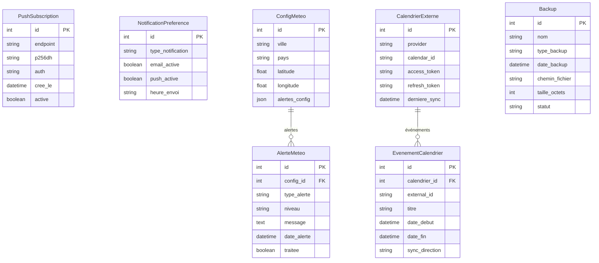
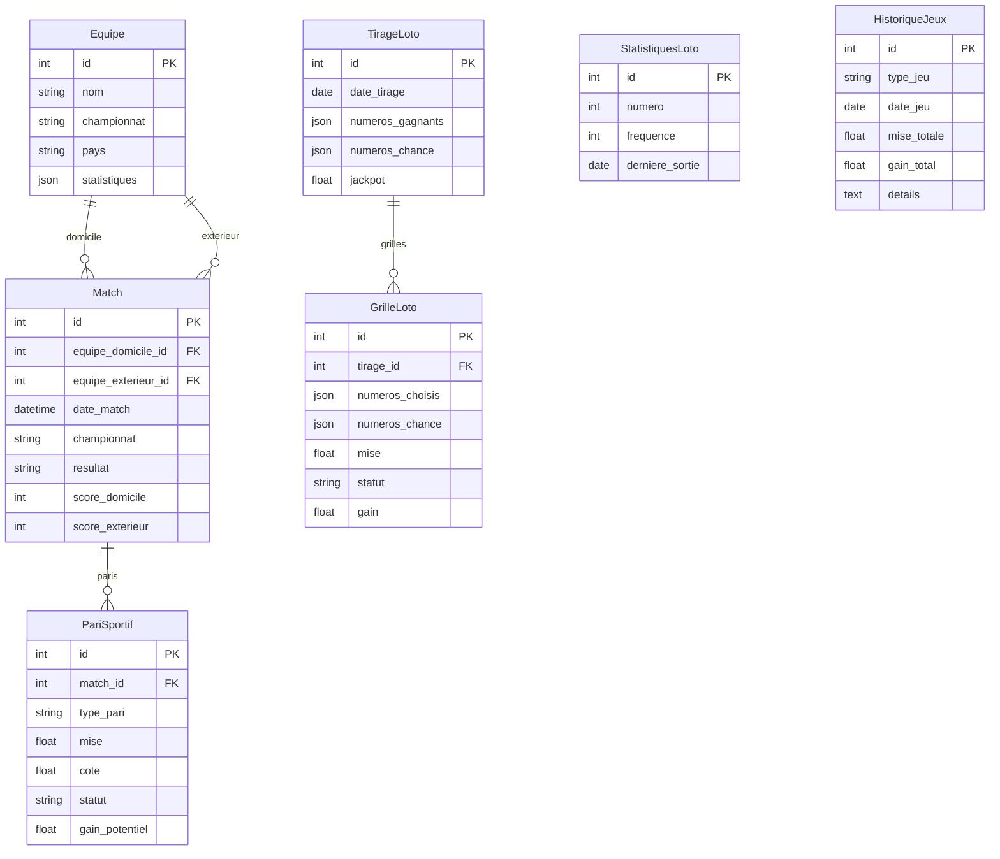

# 📊 Schéma ERD - Modèles de Données Assistant Matanne

> Diagramme Entity-Relationship des tables SQLAlchemy
> Mise à jour : 2 avril 2026

## Référence

- Source de vérité SQL: `sql/schema/*.sql` (structure modulaire SQL-first)
- Nombre de tables cible: 143
- Ce document sert de vue fonctionnelle par domaines; la validation finale passe par le schéma SQL modulaire

Validation (1 avril 2026):

- 143 tables ORM détectées dans `src/core/models/*.py` (hors `mixins.py`)
- alignement maintenu avec `sql/schema/*.sql`

### Procédure de rafraîchissement

1. Mettre à jour les fichiers sous `sql/schema/`
2. Régénérer `sql/INIT_COMPLET.sql` via `scripts/db/regenerate_init.py`
3. Vérifier l'alignement ORM (`src/core/models/`)
4. Mettre à jour ce document (sections impactées + relations)
5. Contrôler les index et clés étrangères avec `docs/guides/DATABASE_INDEXES.md`

## Vue d'ensemble

```mermaid
erDiagram
    %% ═══════════════════════════════════════════════════
    %% CUISINE - Recettes et Ingrédients
    %% ═══════════════════════════════════════════════════

    Ingredient {
        int id PK
        string nom UK
        string categorie
        string unite
        datetime cree_le
    }

    Recette {
        int id PK
        string nom
        text description
        int temps_preparation
        int temps_cuisson
        int portions
        string difficulte
        string type_repas
        string saison
        boolean bio
        boolean adapte_robots
        json nutrition
        datetime cree_le
    }

    RecetteIngredient {
        int id PK
        int recette_id FK
        int ingredient_id FK
        float quantite
        string unite
        string preparation
    }

    EtapeRecette {
        int id PK
        int recette_id FK
        int ordre
        text instruction
        int duree_minutes
    }

    VersionRecette {
        int id PK
        int recette_id FK
        string type_version
        text instructions_modifiees
        text notes
        int age_minimum_mois
    }

    Recette ||--o{ RecetteIngredient : "contient"
    Ingredient ||--o{ RecetteIngredient : "utilisé_dans"
    Recette ||--o{ EtapeRecette : "a_étapes"
    Recette ||--o{ VersionRecette : "a_versions"

    %% ═══════════════════════════════════════════════════
    %% INVENTAIRE
    %% ═══════════════════════════════════════════════════

    ArticleInventaire {
        int id PK
        int ingredient_id FK
        float quantite
        string localisation
        date date_peremption
        float seuil_alerte
        datetime cree_le
    }

    HistoriqueInventaire {
        int id PK
        int article_id FK
        string action
        float quantite_avant
        float quantite_apres
        datetime date_action
    }

    Ingredient ||--o{ ArticleInventaire : "en_stock"
    ArticleInventaire ||--o{ HistoriqueInventaire : "historique"

    %% ═══════════════════════════════════════════════════
    %% COURSES
    %% ═══════════════════════════════════════════════════

    ArticleCourses {
        int id PK
        string nom
        float quantite
        string unite
        string categorie
        boolean achete
        int priorite
        datetime cree_le
    }

    ModeleCourses {
        int id PK
        string nom
        text description
        boolean actif
    }

    ArticleModele {
        int id PK
        int modele_id FK
        string nom
        float quantite
        string unite
    }

    ModeleCourses ||--o{ ArticleModele : "contient"

    %% ═══════════════════════════════════════════════════
    %% PLANNING
    %% ═══════════════════════════════════════════════════

    Planning {
        int id PK
        date date_debut
        date date_fin
        string nom
        datetime cree_le
    }

    Repas {
        int id PK
        int planning_id FK
        int recette_id FK
        date date
        string type_repas
        int portions
        text notes
    }

    CalendarEvent {
        int id PK
        string titre
        text description
        datetime date_debut
        datetime date_fin
        string type_evenement
        boolean recurrent
    }

    Planning ||--o{ Repas : "contient"
    Recette ||--o{ Repas : "planifié_dans"

    %% ═══════════════════════════════════════════════════
    %% BATCH COOKING
    %% ═══════════════════════════════════════════════════

    SessionBatchCooking {
        int id PK
        string nom
        date date_session
        string statut
        int duree_totale_minutes
        text notes
    }

    EtapeBatchCooking {
        int id PK
        int session_id FK
        int recette_id FK
        int ordre
        string statut
        text instructions
    }

    PreparationBatch {
        int id PK
        int session_id FK
        int recette_id FK
        int portions
        string stockage
        date date_peremption
    }

    SessionBatchCooking ||--o{ EtapeBatchCooking : "étapes"
    SessionBatchCooking ||--o{ PreparationBatch : "préparations"
    Recette ||--o{ EtapeBatchCooking : "utilisée"
    Recette ||--o{ PreparationBatch : "préparée"
```

---

## Dernière validation — Avril 2026

- Vérification manuelle: alignement avec l'organisation SQL modulaire (`sql/schema/`)
- Référence migration: `docs/MIGRATION_GUIDE.md`
- Référence performances/index: `docs/guides/DATABASE_INDEXES.md`

## Famille & Utilisateurs

```mermaid
erDiagram
    %% ═══════════════════════════════════════════════════
    %% UTILISATEURS
    %% ═══════════════════════════════════════════════════

    UserProfile {
        int id PK
        string nom
        string email
        string role
        json preferences
        json objectifs_fitness
        datetime cree_le
    }

    GarminToken {
        int id PK
        int user_id FK
        string access_token
        string refresh_token
        datetime expires_at
    }

    GarminActivity {
        int id PK
        int user_id FK
        string type_activite
        datetime date_activite
        int duree_secondes
        float distance_metres
        int calories
    }

    GarminDailySummary {
        int id PK
        int user_id FK
        date date
        int pas
        int calories_totales
        int minutes_actives
        int score_stress
        json sommeil
    }

    FoodLog {
        int id PK
        int user_id FK
        datetime date_heure
        string repas_type
        string aliments
        int calories
    }

    UserProfile ||--o| GarminToken : "token_garmin"
    UserProfile ||--o{ GarminActivity : "activités"
    UserProfile ||--o{ GarminDailySummary : "résumés"
    UserProfile ||--o{ FoodLog : "journal_alimentaire"

    %% ═══════════════════════════════════════════════════
    %% FAMILLE
    %% ═══════════════════════════════════════════════════

    ChildProfile {
        int id PK
        string prenom
        date date_naissance
        json preferences
        text notes
    }

    Milestone {
        int id PK
        int child_id FK
        string categorie
        string titre
        date date_atteint
        text notes
    }

    FamilyActivity {
        int id PK
        string titre
        text description
        datetime date_activite
        string type_activite
        json participants
    }

    WeekendActivity {
        int id PK
        string titre
        text description
        date date_weekend
        string type_activite
        string lieu
        float budget_estime
    }

    FamilyPurchase {
        int id PK
        string nom
        string categorie
        float prix_estime
        string priorite
        string pour_qui
        boolean achete
    }

    ChildProfile ||--o{ Milestone : "étapes_dev"

    %% ═══════════════════════════════════════════════════
    %% PRÉFÉRENCES & APPRENTISSAGE IA
    %% ═══════════════════════════════════════════════════

    UserPreference {
        int id PK
        string categorie
        string cle
        json valeur
        datetime modifie_le
    }

    RecipeFeedback {
        int id PK
        int recette_id FK
        string type_feedback
        int score
        text commentaire
        datetime cree_le
    }

    Recette ||--o{ RecipeFeedback : "feedbacks"
```

## Maison & Projets

```mermaid
erDiagram
    %% ═══════════════════════════════════════════════════
    %% PROJETS
    %% ═══════════════════════════════════════════════════

    Project {
        int id PK
        string nom
        text description
        string statut
        string priorite
        date date_debut
        date date_fin_prevue
        float budget
    }

    ProjectTask {
        int id PK
        int project_id FK
        string titre
        text description
        string statut
        date date_echeance
    }

    Project ||--o{ ProjectTask : "tâches"

    %% ═══════════════════════════════════════════════════
    %% ROUTINES
    %% ═══════════════════════════════════════════════════

    Routine {
        int id PK
        string nom
        string frequence
        string heure_execution
        boolean active
    }

    RoutineTask {
        int id PK
        int routine_id FK
        string titre
        int ordre
        int duree_minutes
    }

    Routine ||--o{ RoutineTask : "tâches"

    %% ═══════════════════════════════════════════════════
    %% JARDIN
    %% ═══════════════════════════════════════════════════

    GardenZone {
        int id PK
        string nom
        string type_zone
        float surface_m2
        text description
        json exposition
    }

    GardenItem {
        int id PK
        int zone_id FK
        string nom
        string type_plante
        date date_plantation
        string statut
    }

    GardenLog {
        int id PK
        int item_id FK
        datetime date_action
        string type_action
        text notes
        json photos
    }

    GardenZone ||--o{ GardenItem : "plantes"
    GardenItem ||--o{ GardenLog : "journal"

    %% ═══════════════════════════════════════════════════
    %% MEUBLES & DÉPENSES
    %% ═══════════════════════════════════════════════════

    Meuble {
        int id PK
        string nom
        text description
        string piece
        string categorie
        decimal prix_estime
        decimal prix_max
        decimal prix_reel
        string statut
        string priorite
        string magasin
        string url
        string reference
        int largeur_cm
        int hauteur_cm
        int profondeur_cm
        date date_souhait
        date date_achat
        datetime created_at
        datetime updated_at
    }

    HouseExpense {
        int id PK
        string categorie
        string description
        float montant
        date date_depense
        boolean recurrent
    }

    MaintenanceTask {
        int id PK
        string titre
        string type_maintenance
        date date_prevue
        string frequence
        boolean effectue
    }

    EcoAction {
        int id PK
        string titre
        string type_action
        float economie_estimee
        boolean realise
        date date_realisation
    }

    %% ═══════════════════════════════════════════════════
    %% DIAGNOSTICS & ESTIMATION IMMOBILIÈRE
    %% ═══════════════════════════════════════════════════

    DiagnosticMaison {
        int id PK
        string type_diagnostic
        string resultat
        text resultat_detail
        string diagnostiqueur
        string numero_certification
        date date_realisation
        date date_validite
        int duree_validite_ans
        string score_energie
        string score_ges
        float consommation_kwh_m2
        float emission_co2_m2
        float surface_m2
        string document_path
        boolean alerte_active
        int alerte_jours_avant
        text recommandations
        text notes
        datetime created_at
        datetime updated_at
    }

    EstimationImmobiliere {
        int id PK
        string source
        date date_estimation
        decimal valeur_basse
        decimal valeur_moyenne
        decimal valeur_haute
        decimal prix_m2
        float surface_m2
        int nb_pieces
        string code_postal
        string commune
        int nb_transactions_comparees
        decimal prix_m2_quartier
        float evolution_annuelle_pct
        decimal investissement_travaux
        decimal plus_value_estimee
        text notes
        datetime created_at
        datetime updated_at
    }

    %% ═══════════════════════════════════════════════════
    %% CONTRATS MAISON
    %% ═══════════════════════════════════════════════════

    Contrat {
        int id PK
        string nom
        string type_contrat
        string fournisseur
        string numero_contrat
        string numero_client
        date date_debut
        date date_fin
        date date_renouvellement
        int duree_engagement_mois
        boolean tacite_reconduction
        int preavis_resiliation_jours
        date date_limite_resiliation
        decimal montant_mensuel
        decimal montant_annuel
        string telephone
        string email
        string espace_client_url
        string statut
        int alerte_jours_avant
        boolean alerte_active
        text notes
        string document_path
        datetime created_at
        datetime updated_at
    }

    %% ═══════════════════════════════════════════════════
    %% ARTISANS & INTERVENTIONS
    %% ═══════════════════════════════════════════════════

    Artisan {
        int id PK
        string nom
        string entreprise
        string metier
        string specialite
        string telephone
        string telephone2
        string email
        text adresse
        string zone_intervention
        int note
        boolean recommande
        string site_web
        string siret
        boolean assurance_decennale
        text qualifications
        text notes
        datetime created_at
        datetime updated_at
    }

    InterventionArtisan {
        int id PK
        int artisan_id FK
        date date_intervention
        text description
        string piece
        decimal montant_devis
        decimal montant_facture
        boolean paye
        int satisfaction
        text commentaire
        string facture_path
        datetime created_at
        datetime updated_at
    }

    Artisan ||--o{ InterventionArtisan : "interventions"

```

## Notifications & Intégrations

```mermaid
erDiagram
    %% ═══════════════════════════════════════════════════
    %% NOTIFICATIONS
    %% ═══════════════════════════════════════════════════

    PushSubscription {
        int id PK
        string endpoint
        string p256dh
        string auth
        datetime cree_le
        boolean active
    }

    NotificationPreference {
        int id PK
        string type_notification
        boolean email_active
        boolean push_active
        string heure_envoi
    }

    %% ═══════════════════════════════════════════════════
    %% MÉTÉO
    %% ═══════════════════════════════════════════════════

    ConfigMeteo {
        int id PK
        string ville
        string pays
        float latitude
        float longitude
        json alertes_config
    }

    AlerteMeteo {
        int id PK
        int config_id FK
        string type_alerte
        string niveau
        text message
        datetime date_alerte
        boolean traitee
    }

    ConfigMeteo ||--o{ AlerteMeteo : "alertes"

    %% ═══════════════════════════════════════════════════
    %% CALENDRIER EXTERNE
    %% ═══════════════════════════════════════════════════

    CalendrierExterne {
        int id PK
        string provider
        string calendar_id
        string access_token
        string refresh_token
        datetime derniere_sync
    }

    EvenementCalendrier {
        int id PK
        int calendrier_id FK
        string external_id
        string titre
        datetime date_debut
        datetime date_fin
        string sync_direction
    }

    CalendrierExterne ||--o{ EvenementCalendrier : "événements"

    %% ═══════════════════════════════════════════════════
    %% BACKUP
    %% ═══════════════════════════════════════════════════

    Backup {
        int id PK
        string nom
        string type_backup
        datetime date_backup
        string chemin_fichier
        int taille_octets
        string statut
    }
```

## Jeux (Paris & Loto)

```mermaid
erDiagram
    %% ═══════════════════════════════════════════════════
    %% PARIS SPORTIFS
    %% ═══════════════════════════════════════════════════

    Equipe {
        int id PK
        string nom
        string championnat
        string pays
        json statistiques
    }

    Match {
        int id PK
        int equipe_domicile_id FK
        int equipe_exterieur_id FK
        datetime date_match
        string championnat
        string resultat
        int score_domicile
        int score_exterieur
    }

    PariSportif {
        int id PK
        int match_id FK
        string type_pari
        float mise
        float cote
        string statut
        float gain_potentiel
    }

    Equipe ||--o{ Match : "domicile"
    Equipe ||--o{ Match : "exterieur"
    Match ||--o{ PariSportif : "paris"

    %% ═══════════════════════════════════════════════════
    %% LOTO
    %% ═══════════════════════════════════════════════════

    TirageLoto {
        int id PK
        date date_tirage
        json numeros_gagnants
        json numeros_chance
        float jackpot
    }

    GrilleLoto {
        int id PK
        int tirage_id FK
        json numeros_choisis
        json numeros_chance
        float mise
        string statut
        float gain
    }

    StatistiquesLoto {
        int id PK
        int numero
        int frequence
        date derniere_sortie
    }

    TirageLoto ||--o{ GrilleLoto : "grilles"

    HistoriqueJeux {
        int id PK
        string type_jeu
        date date_jeu
        float mise_totale
        float gain_total
        text details
    }
```

---

## Légende

| Symbole  | Signification |
| -------- | ------------- | ----- | ----------- | --- | ---------- |
| `PK`     | Primary Key   |
| `FK`     | Foreign Key   |
| `UK`     | Unique Key    |
| `        |               | --o{` | One-to-Many |
| `        |               | --    |             | `   | One-to-One |
| `}o--o{` | Many-to-Many  |

## Statistiques

| Catégorie         | Tables  | Relations |
| ----------------- | ------- | --------- |
| **Cuisine**       | 6       | 5         |
| **Inventaire**    | 2       | 2         |
| **Courses**       | 3       | 1         |
| **Planning**      | 3       | 2         |
| **Batch Cooking** | 4       | 4         |
| **Famille**       | 6       | 1         |
| **Utilisateurs**  | 5       | 4         |
| **Maison**        | 18      | 7         |
| **Notifications** | 4       | 1         |
| **Jeux**          | 7       | 4         |
| **Total**         | **58**  | **31**    |

---

## Addendum — Habitat et Garmin

Cette section synthétise les ajouts de périmètre pour l'habitat et l'intégration Garmin.

### Habitat

- `PlanHabitat` : plan importé, référence visuelle, rattachement scénario.
- `PieceHabitat` : segmentation des pièces (nom, type, surface, position).
- `ModificationPlanHabitat` : variantes proposées et transformations IA.
- `ProjetDecoHabitat` : projets déco par pièce et budget prévisionnel.
- `CritereScenarioHabitat` : pondération multicritère pour comparaison de scénarios.

### Garmin / santé

- `GarminToken` : credentials OAuth1 liés au profil utilisateur.
- `ActiviteGarmin` : activités synchronisées (distance, durée, calories).
- `ResumeQuotidienGarmin` : pas, calories, sommeil agrégés par jour.

### Gamification

- `PointsUtilisateur` : snapshot hebdomadaire sport/alimentation/anti-gaspi.
- `BadgeUtilisateur` : badges calculés à partir des règles de points.

Note: les noms exacts de colonnes et contraintes restent pilotés par les modèles SQLAlchemy et `sql/INIT_COMPLET.sql`.
