# 📊 Schéma ERD - Modèles de Données Assistant Matanne

> Diagramme Entity-Relationship des tables SQLAlchemy

## Vue d'ensemble

```mermaid
erDiagram
    %% ═══════════════════════════════════════════════════
    %% CUISINE - Recettes et Ingrédients
    %% ═══════════════════════════════════════════════════

    Ingredient {
        int id PK
        string nom UK
        string categorie
        string unite
        datetime cree_le
    }

    Recette {
        int id PK
        string nom
        text description
        int temps_preparation
        int temps_cuisson
        int portions
        string difficulte
        string type_repas
        string saison
        boolean bio
        boolean adapte_robots
        json nutrition
        datetime cree_le
    }

    RecetteIngredient {
        int id PK
        int recette_id FK
        int ingredient_id FK
        float quantite
        string unite
        string preparation
    }

    EtapeRecette {
        int id PK
        int recette_id FK
        int ordre
        text instruction
        int duree_minutes
    }

    VersionRecette {
        int id PK
        int recette_id FK
        string type_version
        text instructions_modifiees
        text notes
        int age_minimum_mois
    }

    Recette ||--o{ RecetteIngredient : "contient"
    Ingredient ||--o{ RecetteIngredient : "utilisé_dans"
    Recette ||--o{ EtapeRecette : "a_étapes"
    Recette ||--o{ VersionRecette : "a_versions"

    %% ═══════════════════════════════════════════════════
    %% INVENTAIRE
    %% ═══════════════════════════════════════════════════

    ArticleInventaire {
        int id PK
        int ingredient_id FK
        float quantite
        string localisation
        date date_peremption
        float seuil_alerte
        datetime cree_le
    }

    HistoriqueInventaire {
        int id PK
        int article_id FK
        string action
        float quantite_avant
        float quantite_apres
        datetime date_action
    }

    Ingredient ||--o{ ArticleInventaire : "en_stock"
    ArticleInventaire ||--o{ HistoriqueInventaire : "historique"

    %% ═══════════════════════════════════════════════════
    %% COURSES
    %% ═══════════════════════════════════════════════════

    ArticleCourses {
        int id PK
        string nom
        float quantite
        string unite
        string categorie
        boolean achete
        int priorite
        datetime cree_le
    }

    ModeleCourses {
        int id PK
        string nom
        text description
        boolean actif
    }

    ArticleModele {
        int id PK
        int modele_id FK
        string nom
        float quantite
        string unite
    }

    ModeleCourses ||--o{ ArticleModele : "contient"

    %% ═══════════════════════════════════════════════════
    %% PLANNING
    %% ═══════════════════════════════════════════════════

    Planning {
        int id PK
        date date_debut
        date date_fin
        string nom
        datetime cree_le
    }

    Repas {
        int id PK
        int planning_id FK
        int recette_id FK
        date date
        string type_repas
        int portions
        text notes
    }

    CalendarEvent {
        int id PK
        string titre
        text description
        datetime date_debut
        datetime date_fin
        string type_evenement
        boolean recurrent
    }

    Planning ||--o{ Repas : "contient"
    Recette ||--o{ Repas : "planifié_dans"

    %% ═══════════════════════════════════════════════════
    %% BATCH COOKING
    %% ═══════════════════════════════════════════════════

    SessionBatchCooking {
        int id PK
        string nom
        date date_session
        string statut
        int duree_totale_minutes
        text notes
    }

    EtapeBatchCooking {
        int id PK
        int session_id FK
        int recette_id FK
        int ordre
        string statut
        text instructions
    }

    PreparationBatch {
        int id PK
        int session_id FK
        int recette_id FK
        int portions
        string stockage
        date date_peremption
    }

    SessionBatchCooking ||--o{ EtapeBatchCooking : "étapes"
    SessionBatchCooking ||--o{ PreparationBatch : "préparations"
    Recette ||--o{ EtapeBatchCooking : "utilisée"
    Recette ||--o{ PreparationBatch : "préparée"
```

## Famille & Utilisateurs

## Maison & Projets

## Notifications & Intégrations

## Jeux (Paris & Loto)

---

## Légende

| Symbole  | Signification |
| -------- | ------------- | ----- | ----------- | --- | ---------- |
| `PK`     | Primary Key   |
| `FK`     | Foreign Key   |
| `UK`     | Unique Key    |
| `        |               | --o{` | One-to-Many |
| `        |               | --    |             | `   | One-to-One |
| `}o--o{` | Many-to-Many  |

## Statistiques

| Catégorie         | Tables  | Relations |
| ----------------- | ------- | --------- |
| **Cuisine**       | 6       | 5         |
| **Inventaire**    | 2       | 2         |
| **Courses**       | 3       | 1         |
| **Planning**      | 3       | 2         |
| **Batch Cooking** | 4       | 4         |
| **Famille**       | 6       | 1         |
| **Utilisateurs**  | 5       | 4         |
| **Maison**        | 9       | 3         |
| **Notifications** | 4       | 1         |
| **Jeux**          | 7       | 4         |
| **Total**         | **~50** | **~27**   |
