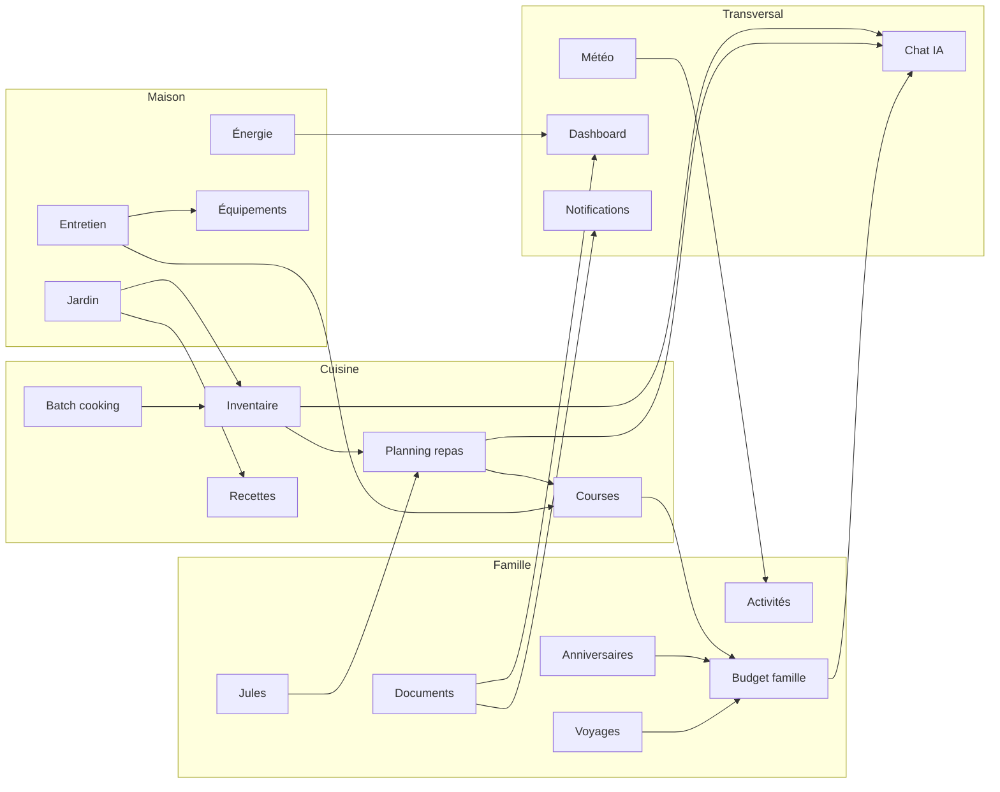

# Interactions Inter-Modules

> Cartographie complète des 21+ bridges en production, carte visuelle des flux, mécanismes de couplage et guide de création.
>
> **Fusionné depuis** : INTER_MODULES.md + INTER_MODULES_MAP.md
>
> **Dernière mise à jour** : 1er avril 2026

---

## Mécanismes utilisés

Les interactions cross-module reposent sur :

| Mécanisme | Localisation | Usage |
| ----------- | ------------- | ------- |
| **Services inter-module** | `src/services/{module}/inter_module_*.py` | Logique métier cross-module |
| **Bus d'événements** | `src/services/core/events/` | Découplage pub/sub réactif |
| **Jobs planifiés** | `src/services/core/cron/jobs.py` | Synchronisations périodiques |
| **Agrégations dashboard** | `src/services/dashboard/` | Données consolidées multi-modules |
| **Dispatcher notifications** | `src/services/core/notifications/` | Notifications cross-module |

---

## Carte visuelle des flux



---

## Bridges en production — lecture rapide

| Groupe | Flux | Déclencheur / signal | Implémentation principale | Effet visible |
| --- | --- | --- | --- | --- |
| Cuisine | Inventaire → Planning | stock disponible, surplus, équilibre nutritionnel | `inter_module_inventaire_planning.py` | recettes mieux ciblées |
| Cuisine | Jules → Planning | repas familiaux à adapter | `inter_module_jules_nutrition.py` | portions/version enfant |
| Cuisine | Batch cooking → Stock | session terminée | `inter_module_batch_inventaire.py` | déduction ingrédients |
| Cuisine | Péremption → Recettes | produits proches expiration | `inter_module_peremption_recettes.py` | suggestions anti-gaspillage |
| Cuisine | Jardin → Recettes | récolte disponible | `inter_module_jardin_recettes.py` | menus de saison |
| Famille | Météo → Activités | prévisions météo | `inter_module_meteo_activites.py` | suggestions intérieur / extérieur |
| Famille | Weekend → Courses | activité prévue | `inter_module_weekend_courses.py` | matériel / achats associés |
| Famille | Documents → Calendrier | échéance proche | `inter_module_documents_calendrier.py` | rappels anticipés |
| Famille | Budget → Notifications | anomalie détectée | `inter_module_budget_anomalie.py` | alerte multi-canal |
| Famille | Anniversaires → Budget | J-14 avant événement | `inter_module_anniversaires_budget.py` | provision automatique |
| Famille | Voyages → Budget | dépenses ou clôture voyage | `inter_module_voyages_budget.py` | suivi consolidé |
| Maison | Entretien → Courses | tâche ménage / entretien | `inter_module_entretien_courses.py` | articles suggérés |
| Maison | Charges → Énergie | hausse anormale | `inter_module_charges_energie.py` | analyse ciblée |
| Maison | Jardin → Entretien | saison / cycle des plantes | `inter_module_jardin_entretien.py` | tâches saisonnières |
| Transversal | Multi-module → Chat IA | question contextuelle | `inter_module_chat_contexte.py` | réponses enrichies |
| Transversal | Photo → Diagnostic IA | image analysée | `inter_module_diagnostics_ia.py` | orientation travaux / artisan |
| CRON | Récoltes → Inventaire | job `sync_recoltes_inventaire` | scheduler | stock cuisine mis à jour |
| CRON | Entretien → Budget | job `sync_entretien_budget` | scheduler | dépenses consolidées |
| CRON | Charges → Dashboard | job `sync_charges_dashboard` | scheduler | KPIs à jour |
| Event bus | `stock.modifie` → cache courses | événement métier | subscribers `events/` | cohérence temps réel |
| Event bus | `batch_cooking.termine` → notif + stock | événement métier | subscribers `events/` | feedback immédiat |

---

## Bridges en production (détail)

### Cuisine (7 bridges)

| Bridge | Source → Destination | Méthodes clés |
| -------- | --------------------- | --------------- |
| `inter_module_inventaire_planning.py` | Inventaire → Planning recettes | `suggerer_recettes_selon_stock()`, `exclure_articles_surplus()`, `blocker_batch_jours()`, `analyser_equilibre_nutritionnel()`, `filtrer_recettes_mal_notees()` |
| `inter_module_jules_nutrition.py` | Profil Jules → Portions planning | `adapter_planning_nutrition_jules()`, `adapter_portions_recettes_planifiees()` |
| `inter_module_saison_menu.py` | Saisonnalité → Planning IA | `obtenir_contexte_saisonnier_planning()` |
| `inter_module_courses_budget.py` | Total courses → Budget alimentation | `synchroniser_total_courses_vers_budget()`, `estimer_budget_courses_mensuel()` |
| `inter_module_batch_inventaire.py` | Batch cooking terminé → Déduction stock | `deduire_ingredients_session_terminee()` |
| `inter_module_peremption_recettes.py` | Péremption → Suggestions anti-gaspillage | Déclenche suggestions IA pour produits expirants |
| `inter_module_jardin_recettes.py` | Récolte jardin → Recettes semaine suivante | `suggerer_recettes_depuis_recolte()` |

### Famille (6 bridges)

| Bridge | Source → Destination | Méthodes clés |
| -------- | --------------------- | --------------- |
| `inter_module_meteo_activites.py` | Météo → Activités famille | `suggerer_activites_selon_meteo()` (pluie = intérieur, soleil = extérieur) |
| `inter_module_weekend_courses.py` | Activités weekend → Courses | `suggerer_fournitures_weekend()` (matériel rando, pique-nique) |
| `inter_module_documents_calendrier.py` | Documents expirants → Calendrier | `synchroniser_documents_vers_calendrier()` (rappel J-14) |
| `inter_module_budget_anomalie.py` | Anomalie budget → Notifications | `detecter_et_notifier_anomalies()` (seuil: +30% vs mois précédent) |
| `inter_module_anniversaires_budget.py` | Anniversaire J-14 → Budget prévisionnel | `reserver_budget_previsionnel_j14()` |
| `inter_module_voyages_budget.py` | Voyages → Budget sync | Sync dépenses voyage vers budget |

### Maison (3 bridges)

| Bridge | Source → Destination | Méthodes clés |
| -------- | --------------------- | --------------- |
| `inter_module_entretien_courses.py` | Tâches entretien → Courses | `suggerer_produits_entretien_pour_courses()` (produits ménagers) |
| `inter_module_charges_energie.py` | Anomalie charges → Analyse énergie | `detecter_hausse_et_declencher_analyse()` (seuil: +20% vs mois précédent) |
| `inter_module_jardin_entretien.py` | Saison jardin → Entretien auto | `generer_taches_saisonnieres_depuis_plantes()` |

### Cross-module (2 bridges)

| Bridge | Source → Destination | Méthodes clés |
| -------- | --------------------- | --------------- |
| `inter_module_chat_contexte.py` | Multi-module → Chat IA | `collecter_contexte_complet()` (frigo, planning, courses, budget, anniversaires, documents, tâches) |
| `inter_module_diagnostics_ia.py` | Photo → Diagnostic IA → Artisans | `diagnostiquer_panne_photo()`, `creer_projet_maison_depuis_diagnostic()` |

### Interactions via jobs CRON

| Job | Source → Destination |
| ----- | --------------------- |
| `sync_recoltes_inventaire` | Récoltes jardin → Inventaire cuisine |
| `sync_jeux_budget` | Gains/pertes jeux → Budget famille |
| `sync_entretien_budget` | Coûts entretien → Dépenses |
| `sync_charges_dashboard` | Charges fixes → Métriques dashboard |
| `suggestions_activites_meteo` | Météo → Activités |
| `sync_routines_planning` | Routines → Planning quotidien |

### Interactions via event bus

| Événement | Réaction |
| ----------- | ---------- |
| `jardin.recolte` | Invalidation cache recettes/planning/suggestions |
| `energie.anomalie` | Création tâche entretien |
| `budget.depassement` | Invalidation dashboard + agent proactif |
| `document.echeance_proche` | Notification ntfy/push |
| `batch_cooking.termine` | Déduction stock + notification |
| `stock.modifie` | Invalidation cache courses |

---

## Observabilité des bridges

### Endpoint admin de statut

```http
GET /api/v1/admin/bridges/status?inclure_smoke=true
```

Retourne par bridge : `id`, `bridge`, `intitulé`, `vérification`, `statut`, `latence_ms`, `détails`.

### Event bus inspection

```http
GET /api/v1/admin/events?limite=30&type_evenement=recette.*
```

### Trigger manuel (test)

```http
POST /api/v1/admin/events/trigger
{
  "type_evenement": "jardin.recolte",
  "source": "admin",
  "payload": {"element_id": 5, "nom": "tomates", "quantite": 10}
}
```

---

## Guide de création d'un nouveau bridge

### Pattern 1 : Service inter-module avec événement

```python
# src/services/{module}/inter_module_{source}_{dest}.py

from src.services.core.registry import service_factory
from src.core.decorators import avec_gestion_erreurs, avec_session_db

class SourceDestInteractionService:
    """Bridge de Source vers Dest."""
    
    @avec_gestion_erreurs(default_return={})
    @avec_session_db
    def action_name(self, *, db=None):
        result = self._process()
        
        from src.services.core.events import obtenir_bus
        obtenir_bus().emettre(
            "module.action_complete",
            {"data": result},
            source="source_module"
        )
        return result

@service_factory("source_dest_interaction", tags={"source", "dest"})
def obtenir_service_source_dest():
    return SourceDestInteractionService()
```

### Pattern 2 : Subscriber réactif via event bus

```python
# Dans src/services/core/events/subscribers.py

def _handler_module_action(event: EvenementDomaine) -> None:
    try:
        from src.services.dest import obtenir_service_dest
        service = obtenir_service_dest()
        service.react_to_source_change(event.data, event.source)
    except Exception as e:
        logger.warning(f"Subscriber failed gracefully: {e}")
```

### Pattern 3 : Invalidation cache sur événement

```python
def _invalider_cache_module(event: EvenementDomaine) -> None:
    try:
        from src.core.caching import obtenir_cache
        nb = obtenir_cache().invalidate(pattern="module_*")
        logger.debug(f"Cache invalidated: {nb} entries on {event.type}")
    except Exception:
        logger.warning("Cache invalidation failed")
```

### Enregistrement des subscribers

Dans `enregistrer_subscribers()` :

```python
bus = obtenir_bus()
bus.souscrire("module.changed", _invalider_cache_module, priority=10)   # cache
bus.souscrire("module.*", _handler_module_action, priority=5)           # métier
bus.souscrire("*", audit_logger, priority=0)                            # audit
```

---

## Vérification rapide côté admin

| Besoin | Endpoint |
| --- | --- |
| Voir l'état global des bridges | `GET /api/v1/admin/bridges/status?inclure_smoke=true` |
| Inspecter les événements récents | `GET /api/v1/admin/events?limite=30` |
| Rejouer un événement métier | `POST /api/v1/admin/events/trigger` |
| Vérifier les jobs liés | `GET /api/v1/admin/jobs` |

---

## Ponts prioritaires du planning

Les prochains flux ciblés :

1. **Planning validé → Courses auto** (`planning.valide`)
2. **Entretien terminé → mise à jour équipement**
3. **Batch terminé → pré-remplissage planning**
4. **Feedback recette → ajustement du poids de suggestion**
5. **Météo → alertes jardin**
6. **Garmin sport → adaptation nutrition**

---

## Liens utiles

- `docs/EVENT_BUS.md` — fonctionnement du pub/sub interne
- `docs/AUTOMATIONS.md` — moteur Si→Alors et exploitation admin
- `docs/ADMIN.md` — guide opérationnel admin
