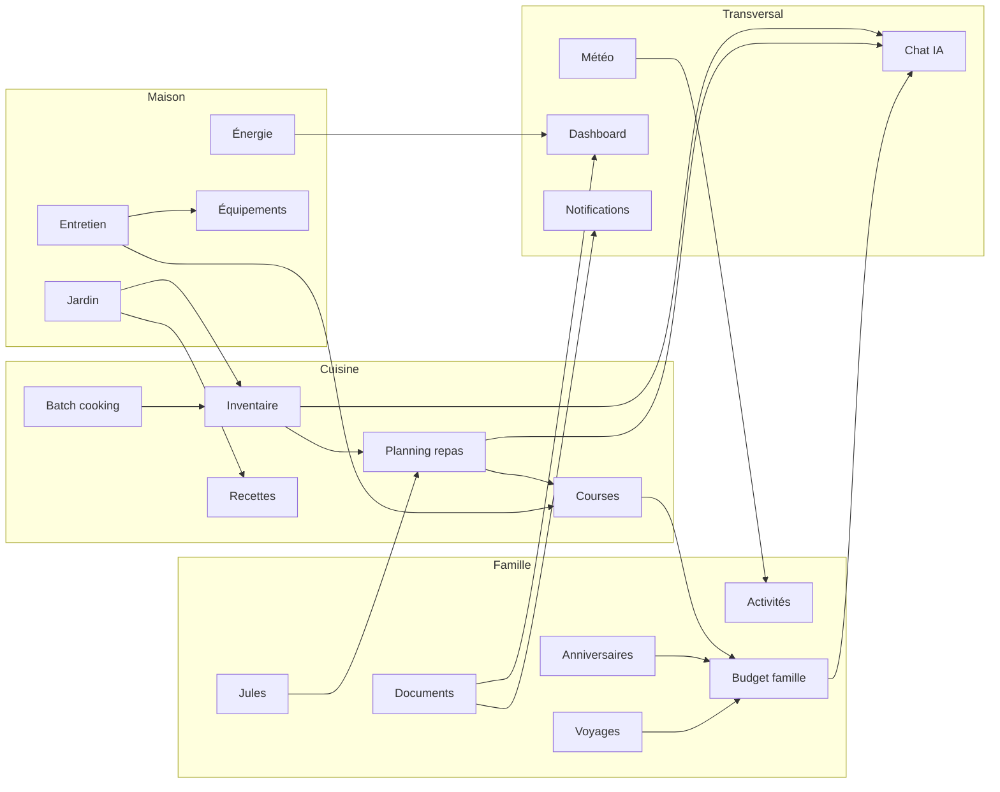

# Carte des interactions inter-modules

> Vue synthétique des flux cross-module déjà en production et des ponts prioritaires à compléter.
>
> Cette carte complète `docs/INTER_MODULES.md` avec une lecture plus visuelle et opérationnelle.

---

## Vue d'ensemble

Les flux inter-modules s'appuient sur 4 mécanismes principaux :

| Mécanisme | Usage | Localisation |
| --- | --- | --- |
| **Services inter-module** | logique métier dédiée entre deux domaines | `src/services/**/inter_module_*.py` |
| **Event bus** | réactions découplées et invalidation de cache | `src/services/core/events/` |
| **Jobs planifiés** | synchronisations périodiques et enrichissements | `src/services/core/cron/jobs.py` |
| **Agrégations dashboard** | KPIs consolidés et synthèses multi-domaines | `src/services/dashboard/` |

---

## Carte visuelle des flux

---

## Bridges en production — lecture rapide

| Groupe | Flux | Déclencheur / signal | Implémentation principale | Effet visible |
| --- | --- | --- | --- | --- |
| Cuisine | Inventaire → Planning | stock disponible, surplus, équilibre nutritionnel | `inter_module_inventaire_planning.py` | recettes mieux ciblées |
| Cuisine | Jules → Planning | repas familiaux à adapter | `inter_module_jules_nutrition.py` | portions/version enfant |
| Cuisine | Batch cooking → Stock | session terminée | `inter_module_batch_inventaire.py` | déduction ingrédients |
| Cuisine | Péremption → Recettes | produits proches expiration | `inter_module_peremption_recettes.py` | suggestions anti-gaspillage |
| Cuisine | Jardin → Recettes | récolte disponible | `inter_module_jardin_recettes.py` | menus de saison |
| Famille | Météo → Activités | prévisions météo | `inter_module_meteo_activites.py` | suggestions intérieur / extérieur |
| Famille | Weekend → Courses | activité prévue | `inter_module_weekend_courses.py` | matériel / achats associés |
| Famille | Documents → Calendrier | échéance proche | `inter_module_documents_calendrier.py` | rappels anticipés |
| Famille | Budget → Notifications | anomalie détectée | `inter_module_budget_anomalie.py` | alerte multi-canal |
| Famille | Anniversaires → Budget | J-14 avant événement | `inter_module_anniversaires_budget.py` | provision automatique |
| Famille | Voyages → Budget | dépenses ou clôture voyage | `inter_module_voyages_budget.py` | suivi consolidé |
| Maison | Entretien → Courses | tâche ménage / entretien | `inter_module_entretien_courses.py` | articles suggérés |
| Maison | Charges → Énergie | hausse anormale | `inter_module_charges_energie.py` | analyse ciblée |
| Maison | Jardin → Entretien | saison / cycle des plantes | `inter_module_jardin_entretien.py` | tâches saisonnières |
| Transversal | Multi-module → Chat IA | question contextuelle | `inter_module_chat_contexte.py` | réponses enrichies |
| Transversal | Photo → Diagnostic IA | image analysée | `inter_module_diagnostics_ia.py` | orientation travaux / artisan |
| CRON | Récoltes → Inventaire | job `sync_recoltes_inventaire` | scheduler | stock cuisine mis à jour |
| CRON | Entretien → Budget | job `sync_entretien_budget` | scheduler | dépenses consolidées |
| CRON | Charges → Dashboard | job `sync_charges_dashboard` | scheduler | KPIs à jour |
| Event bus | `stock.modifie` → cache courses | événement métier | subscribers `events/` | cohérence temps réel |
| Event bus | `batch_cooking.termine` → notif + stock | événement métier | subscribers `events/` | feedback immédiat |

---

## Ponts prioritaires du planning

Les prochains flux explicitement ciblés dans `PLANNING_IMPLEMENTATION.md` sont :

1. **Planning validé → Courses auto** (`planning.valide`)
2. **Entretien terminé → mise à jour équipement**
3. **Batch terminé → pré-remplissage planning**
4. **Feedback recette → ajustement du poids de suggestion**
5. **Météo → alertes jardin**
6. **Garmin sport → adaptation nutrition**

### Consolidation Phase 2 — bridges legacy

Les 11 anciens wrappers `inter_module_*` visés par la phase 2 sont désormais **consolidés en compatibilité** vers les implémentations stables `bridges_*` et exposés dans un catalogue central :

- `GET /api/v1/bridges/catalogue` — vue métier des wrappers consolidés
- `GET /api/v1/admin/bridges/status` — statut opérationnel + résumé Phase 2

Cette consolidation couvre notamment : `dashboard_actions`, `chat_event_bus`, `chat_contexte`, `weekend_courses`, `voyages_budget`, `meteo_activites`, `documents_calendrier`, `saison_menu`, `jardin_entretien`, `entretien_courses` et `charges_energie`.

---

## Vérification rapide côté admin

| Besoin | Endpoint |
| --- | --- |
| Voir l'état global des bridges | `GET /api/v1/admin/bridges/status?inclure_smoke=true` |
| Inspecter les événements récents | `GET /api/v1/admin/events?limite=30` |
| Rejouer un événement métier | `POST /api/v1/admin/events/trigger` |
| Vérifier les jobs liés | `GET /api/v1/admin/jobs` |

---

## Liens utiles

- `docs/INTER_MODULES.md` — inventaire détaillé et patterns de création
- `docs/EVENT_BUS.md` — fonctionnement du pub/sub interne
- `docs/AUTOMATIONS.md` — moteur Si→Alors et exploitation admin
- `PLANNING_IMPLEMENTATION.md` — priorités des phases 6 à 8
