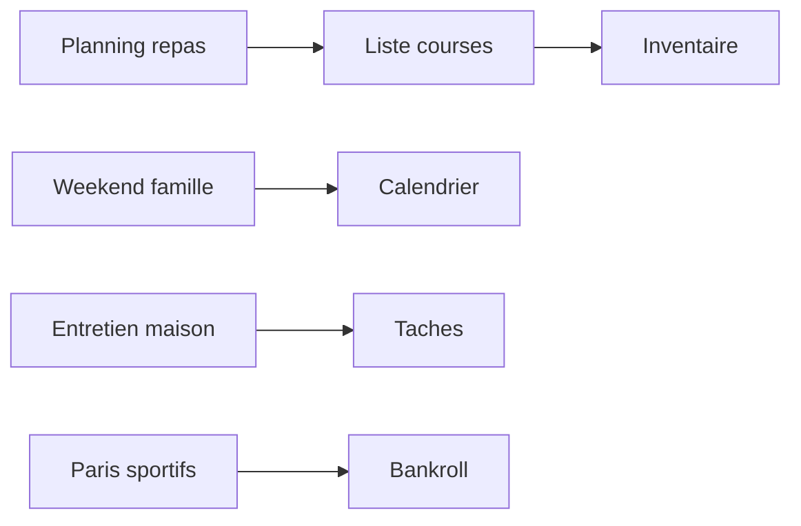

# User Flows

## Objectif

Documenter les parcours principaux des utilisateurs pour les modules Cuisine, Famille, Maison et Jeux.

## Flux 1 - Cuisine (planifier puis acheter)

1. Ouvrir le planning repas de la semaine
2. Valider les recettes proposees
3. Generer la liste de courses
4. Cocher les achats
5. Mettre a jour l inventaire

Exemple de point d entree frontend:

```tsx
'use client'

import { genererListeCourses } from '@/bibliotheque/api/courses'

export async function actionGenererCourses(planId: number) {
  return genererListeCourses({ plan_id: planId })
}
```

## Flux 2 - Famille (activite weekend)

1. Ouvrir le module Famille weekend
2. Consulter les suggestions IA
3. Selectionner une activite
4. Ajouter au calendrier
5. Ajuster le budget famille si necessaire

Exemple backend simplifie:

```python
@router.post("/famille/weekend/suggestions")
async def suggerer_weekend(payload: dict, user=Depends(require_auth)) -> dict:
    service = get_weekend_ai_service()
    return service.suggerer_activites(payload)
```

## Flux 3 - Maison (entretien)

1. Ouvrir Maison entretien
2. Voir les taches dues
3. Executer une tache
4. Marquer terminee
5. Creer la prochaine occurrence

## Flux 4 - Jeux (suivi bankroll)

1. Ouvrir Jeux paris
2. Ajouter un pari
3. Enregistrer le resultat
4. Mettre a jour la bankroll
5. Consulter le tableau de bord jeux

## Diagramme global (Mermaid)



## Points de vigilance UX

- Eviter les doubles saisies
- Garder les actions frequentes en moins de 3 clics
- Afficher des messages de succes et erreur explicites
- Proposer une action suivante apres une confirmation

## Checklist avant release

- [ ] Flux critiques testes manuellement
- [ ] Endpoints des flux couverts par tests
- [ ] Navigation mobile validee
- [ ] Documentation produit synchronisee
